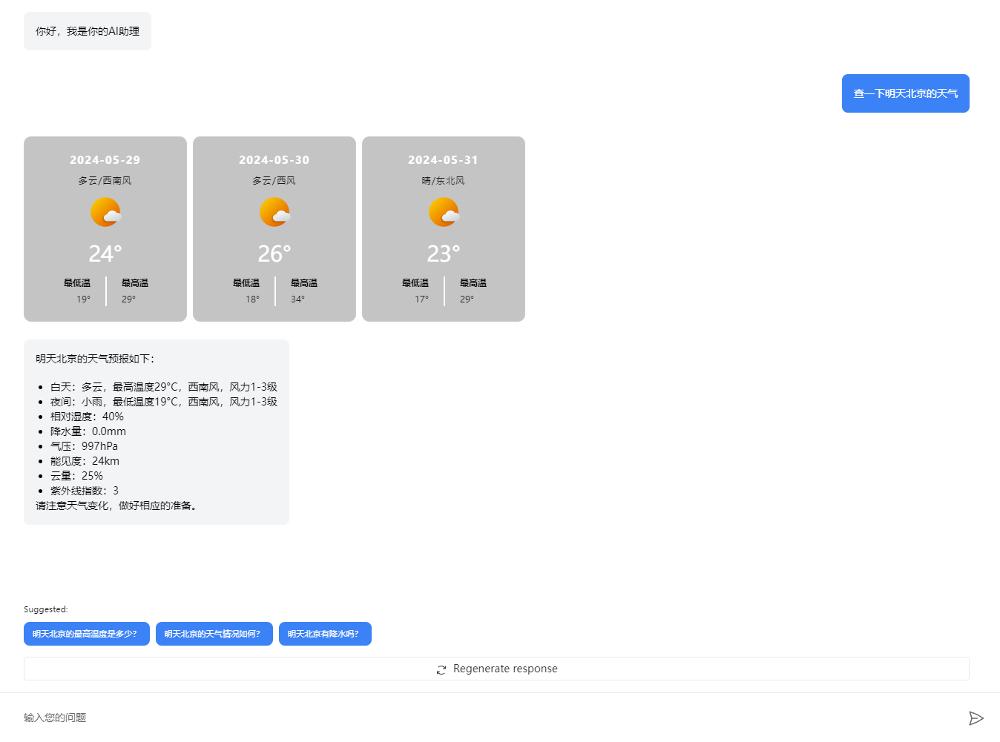

## 使用 Nextjs@15 快速构建 AI 助理机器人

[UI 截图](doc/image.png)


> 这是一个简单的案例利用`copilotkit`来构建一个 AI 助理机器人，主要是为了体验一下 Nextjs@15 的 turpopack 的速度。

```bash
└─app
    │  CopilotConfig.tsx            // 配置文件
    │  CopilotKitProvider.tsx       // ChatProvider
    │  layout.tsx                   // 布局文件
    │  page.tsx                     // 页面文件
    │
    ├─api
    │  └─copilotkit
    │          route.ts             // CopilotKit Backend Runtime
```

比较方便的是可以快速实现一个自定义的 Action，以及自定义的 Chat UI。

### 核心实现代码：
核心代码并不多，主要有一个UI来渲染对应的气象状态，比较麻烦，这边就补贴出来了

> CopilotKitRuntime 后台服务 `app/api/copilotkit/route.ts`

```typescript
import { CopilotRuntime, OpenAIAdapter } from "@copilotkit/backend";

export async function POST(req: Request): Promise<Response> {
  const copilotKit = new CopilotRuntime({
    actions: [ ],
  });
  return copilotKit.response(req, new OpenAIAdapter({
    model: "gpt-3.5-turbo-16k"
  }));
}

```

> CopilotKitProvider `app/CopilotKitProvider.tsx`

```typescript
'use client'
import { CopilotKit } from '@copilotkit/react-core'
import '@copilotkit/react-ui/styles.css'
import React from 'react'

export default function CopilotKitProvider({
  children,
}: React.PropsWithChildren<{}>) {
  return <CopilotKit runtimeUrl='/api/copilotkit'>{children}</CopilotKit>
}
```

> 设置页面 `app/page.tsx`

```typescript
import { CopilotChat } from '@copilotkit/react-ui'

export default function Home() {
  return (
    <>
      <CopilotChat
        className='h-screen'
        labels={{
          title: 'AI助理',
          placeholder: '输入您的问题',
          initial: '你好，我是你的AI助理',
        }}
      />
    </>
  )
}
```

> 通过配置 `app/CopilotConfig.tsx` 定制 CopilotKit
> 我们通过`useCopilotChatSuggestions`来设置 CopilotKit 的提示语。
> 然后通过`useCopilotAction`来注册 Action，这边代码中，我们定义了一个名为`weather`的 Action，该 Action 可以查询指定城市的天气。
> 最后，我们通过`fetch`请求天气数据，并渲染到页面上。

```typescript
'use client'
import { WeatherContainer } from '@/components/WeatherContainer'
import { useCopilotAction } from '@copilotkit/react-core'
import { useCopilotChatSuggestions } from '@copilotkit/react-ui'

export function CopilotConfig() {
  useCopilotChatSuggestions({
    instructions: '提供一些关于Next.js的代码问题.使用中文',
    minSuggestions: 3,
  })

  useCopilotAction({
    name: 'weather',
    description: '查询城市天气',
    parameters: [
      {
        required: true,
        name: 'cityName',
        type: 'string',
        description: '城市名称',
      },
    ],
    handler: async ({ cityName }) => {
      const res = await fetch('/api/weather?city=' + cityName)
        .then(r => r.json())
        .catch(e => {
          return { code: '-1', msg: { reason: '请求失败' } }
        })
      if (res.code !== '200') {
        return `查询失败：${res.msg.reason}`
      }
      return res.daily
    },
    render: ({ status, args, result }) => {
      if (status === 'complete') {
        return <WeatherContainer list={result} />
      } else {
        return 'Processing...'
      }
    },
  })
  return <></>
}
```


完整的代码仓库：

[https://github.com/liuhuapiaoyuan/lesson-nextjs15-copilotkit](https://github.com/liuhuapiaoyuan/lesson-nextjs15-copilotkit)


